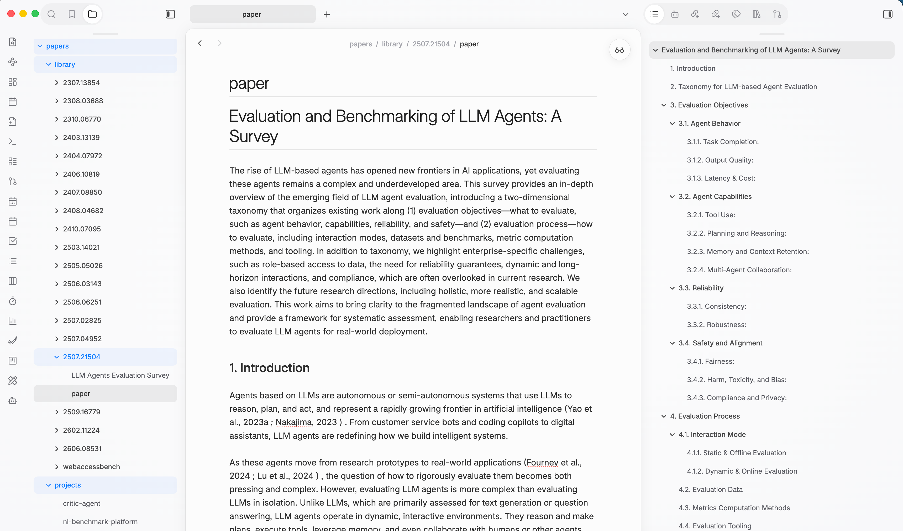
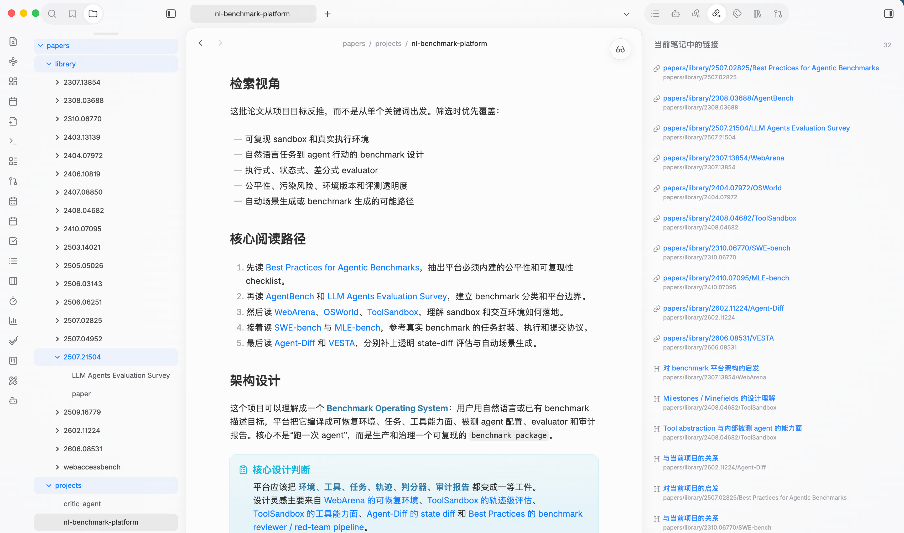

# Paper MD Ingest

[中文](README.md)

Paper MD Ingest is an Obsidian-first agent skill for turning papers, arXiv IDs, official paper URLs, or research topics into a Markdown literature workspace.

It helps an agent:

- fetch papers and convert them into `paper.md`
- initialize structured reading notes with source links
- maintain a lightweight global `PAPERS.md` inventory
- maintain project-level literature maps with Obsidian wikilinks, embeds, and backlinks
- validate Markdown links, Obsidian links, embedded headings, and paper workspace structure

## Install

```bash
npx skills add git@github.com:ffy6511/paper-md-ingest.git
```

HTTPS also works:

```bash
npx skills add https://github.com/ffy6511/paper-md-ingest.git
```

## Usage

Use `paper-md-ingest` when you want to add papers, curate a topic-based paper set, or maintain an Obsidian project-level literature map.

Example:

```text
Use paper-md-ingest to collect 5-10 arXiv papers about <your research topic> into my papers workspace.
```

Recommended papers workspace structure:

```text
papers/
  AGENTS.md
  PAPERS.md
  library/
    <paper-id>/
      paper.md
      <reading-note>.md
  projects/
    <project>.md
```

For a new or immature workspace, the skill includes `references/workspace.md` with starter references for `AGENTS.md`, `PAPERS.md`, and project maps.

## Examples

### Convert papers into agent-friendly Markdown

Each paper lives under `papers/library/<paper-id>/` with a `paper.md` file for agent reading and git diff. Compared with handing an agent raw HTML, LaTeX source, or PDF content, cleaned Markdown is more stable and easier to preview, search, and fold in Obsidian.



### Organize related papers with project maps

Project-level entry points live under `papers/projects/<project>.md`. A project map does not duplicate single-paper notes; it connects them with Obsidian wikilinks. Reading paths, groups, design notes, and key summaries can all live in one project map. The backlinks pane also shows which papers or sections the current project references.



### See paper-project relationships in the graph

Because project maps use Obsidian wikilinks, papers, projects, and the global inventory naturally form a visual graph. The graph is not the primary reading interface, but it is useful for checking which projects cite a paper and whether a project's literature network has taken shape.


## Validation

The bundled validator checks paper directory structure, reading-note frontmatter, `PAPERS.md` coverage, Markdown links, Obsidian wikilinks/embeds, and embedded heading targets:

```bash
python3 skills/paper-md-ingest/scripts/validate_papers_workspace.py --papers-root papers
```
