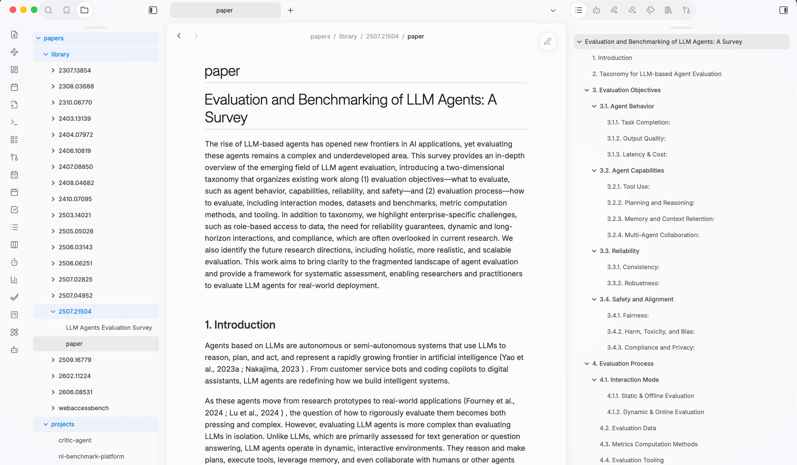
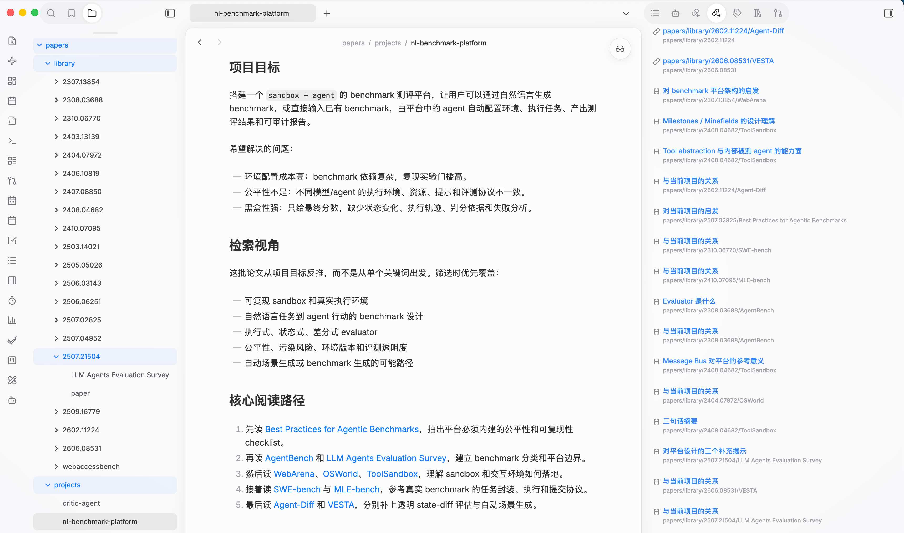
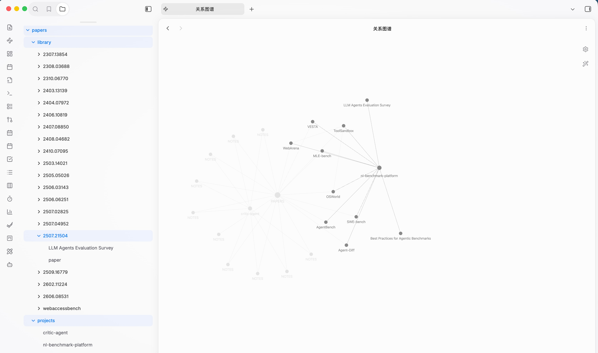

# Paper MD Ingest

[English](README.en.md)

Paper MD Ingest 是一个默认面向 Obsidian 的 agent skill，用来把论文、arXiv ID、官方论文链接或研究主题整理成 Markdown 文献工作区。

它可以帮助 agent：

- 拉取论文并转换为 `paper.md`
- 初始化带 source 链接的结构化阅读笔记
- 维护轻量的 `PAPERS.md` 全局清单
- 用 Obsidian 双链、嵌入和 backlink 维护项目级阅读地图
- 用 `topics/` 维护与特定项目无关的长期聚合索引
- 校验 Markdown 链接、Obsidian 双链、嵌入 heading 和论文目录结构

## 安装

```bash
npx skills add git@github.com:ffy6511/paper-md-ingest.git
```

也可以使用 HTTPS：

```bash
npx skills add https://github.com/ffy6511/paper-md-ingest.git
```

## 使用

当你想新增论文、按研究主题自动整理论文集合，或者维护 Obsidian 项目级文献地图时，让 agent 使用 `paper-md-ingest`。

示例：

```text
使用 paper-md-ingest，围绕 <你的研究主题> 整理 5-10 篇 arXiv 论文到我的 papers 工作区。
```

推荐的 papers 工作区结构：

```text
papers/
  AGENTS.md
  PAPERS.md
  library/
    <paper-id>/
      paper.md
      <reading-note>.md
  projects/
    <project>.md
    <project> roadmap.canvas
  topics/
    <topic>.md
```

如果工作区还没有成型，skill 内置的 `references/workspace.md` 提供了 `AGENTS.md`、`PAPERS.md`、项目地图和主题索引的初始化参考。

## 效果示例

### 论文转成 agent 友好的 Markdown

每篇论文会放在 `papers/library/<paper-id>/` 下，保留一份供 agent 阅读和 diff 的 `paper.md`。相比直接把 HTML、LaTeX source 或 PDF 扔给 agent，清洗后的 Markdown 更稳定，也更容易被 Obsidian 预览、搜索和折叠阅读。



### 用项目地图组织一组相关论文

项目级入口放在 `papers/projects/<project>.md`。它不是复制单篇论文笔记，而是用 Obsidian 双链把相关论文串起来：阅读路径、分组、设计提示和关键摘要都聚合在一个 project map 中。右侧 backlinks 也能反过来显示当前项目引用了哪些论文或章节。



### 用主题索引串起跨项目经典论文

`papers/topics/<topic>.md` 用于不隶属于单一项目的长期阅读路径，例如经典论文、方法族或 benchmark 类别。它只链接 `library/` 的 canonical note，并可嵌入简短摘要；不复制论文，也不创建 roadmap canvas。

### 在关系图谱中看到论文和项目的连接

因为项目地图使用 Obsidian wikilinks，论文、项目、全局索引之间会自然形成可视化关系。它不是主要阅读入口，但很适合快速确认某篇论文被哪些项目引用，或者某个项目的文献网络是否已经成形。



## 校验

仓库内置的 validator 会检查论文目录结构、阅读笔记 frontmatter、`PAPERS.md` 覆盖情况、普通 Markdown 链接、Obsidian 双链/嵌入，以及嵌入目标 heading：

```bash
python3 skills/paper-md-ingest/scripts/validate_papers_workspace.py --papers-root papers
```
